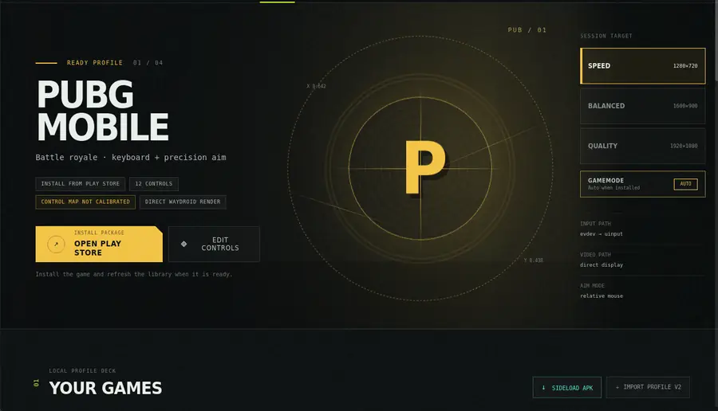

# Wroid Gaming Hub

[](LICENSE)


**Wroid Gaming Hub is an open-source Linux gaming frontend and low-latency input runtime for Android games running through Waydroid.**

It brings together keyboard/mouse controls, profile-driven multitouch input, a visual controls editor, Waydroid lifecycle management, graphics and compatibility diagnostics, and a desktop game library.



> **Project status:** active early-stage development. Wroid is usable for development and hardware testing, but installation, compatibility, and release packaging are still being stabilized.

## Why Wroid?

Waydroid makes it possible to run Android applications on Linux, but a practical desktop gaming experience needs more than application launch. Games often need low-latency keyboard and mouse input, persistent multitouch state, editable control maps, predictable Waydroid session management, graphics diagnostics, and recovery when a launch fails.

Wroid is being built to fill that gap with one transparent, open-source Linux/Waydroid gaming stack.

The project does **not** hide Android root, modify games to bypass integrity checks, or implement anti-cheat/protection evasion.

## What works today

- Native GTK/WebKitGTK **Gaming Hub** for launching and managing games.
- **Controls Studio** for visual profile-v2 editing and calibration.
- Persistent Linux `evdev` input capture and `uinput` multitouch injection.
- Keyboard movement, taps, holds, mouse buttons, and relative mouse aim.
- Managed background game sessions with explicit stop and recovery paths.
- Per-user `wroidd` daemon for session ownership and typed IPC.
- Narrow privileged-helper boundary for the temporary Waydroid input bridge.
- GPU, DRM, EGL/Vulkan, compositor, refresh-rate, ABI, native-bridge, and storage diagnostics.
- GameMode integration when available, with a normal direct-launch fallback.
- Single-APK inspection and sideload flow with format/ABI preflight.
- Editable starter profiles for **Brawl Stars, Standoff 2, PUBG Mobile, and Free Fire**.
- Production-path latency metrics and a hardware-independent injection benchmark.

## Quick start

Wroid currently targets Linux systems with Waydroid. The primary development environment is Arch/CachyOS on Wayland.

On Arch/CachyOS, install the main development dependencies with:

```sh
sudo pacman -S rust cargo adb waydroid gtk3 webkit2gtk-4.1
```

Build and test the workspace:

```sh
cargo build --workspace
cargo test --workspace
```

Build and install the optimized desktop version for the current user:

```sh
cargo build --release --workspace
target/release/wroid desktop install
wroid helper install
```

Then launch the Hub from the application menu or run:

```sh
wroid hub
```

The helper installation is a one-time privileged setup step. Normal Hub/gameplay processes remain unprivileged.

## Gaming workflow

The Hub detects Waydroid, available input devices, installed Android packages, graphics state, and profile readiness. A typical workflow is:

1. Start Waydroid and install a supported Android game.
2. Select the keyboard, mouse, and session render target in Wroid.
3. Open **Controls Studio** to calibrate or edit the control map.
4. Run the input self-test if needed.
5. Launch the game from the Hub.
6. Use `F12` to release/reacquire captured input and `Ctrl+Esc` to stop the Wroid game session.

The same guarded session flow is available from the CLI:

```sh
target/release/wroid launch-v2 ~/.config/wroid/profiles-v2/pubg-mobile.json
```

## Starter profiles

Wroid currently ships profiles for:

- **Brawl Stars** — WASD movement, attack/super/gadget controls.
- **Standoff 2** — WASD, relative mouse aim, fire/ADS/reload and common actions.
- **PUBG Mobile** — WASD, relative mouse aim, mouse buttons and common FPS actions.
- **Free Fire** — WASD, relative mouse aim, fire/ADS and common actions.

Profiles are editable. The starter coordinates assume a default landscape HUD and may need calibration for a user's exact game layout, package variant, and render size.

## Performance

The production path is designed around persistent input rather than spawning an ADB/Waydroid-shell process for every action.

A release benchmark is available without root or a running Waydroid session:

```sh
cargo build --release --bin wroid-inject-latency
target/release/wroid-inject-latency --samples 20000
```

The current development baseline on an RX 6600 XT / CachyOS / KDE Wayland machine is approximately **1 µs p99** for the injection hot path over 20,000 frames. This is a developer baseline, not a guarantee across hardware.

Production sessions also report reader-to-inject and kernel-event-to-inject latency metrics for submitted Android touch frames.

## Compatibility diagnostics

Inspect the current graphics and Waydroid environment with:

```sh
wroid performance
wroid performance --json
wroid compatibility
wroid compatibility --json
```

Wroid can surface issues such as:

- CPU/software rendering;
- host/Waydroid GPU mismatch;
- unavailable native ARM translation on x86_64;
- missing Play Store/GAPPS state;
- known package variants;
- storage pressure on Waydroid's writable volume;
- active Android-root configurations that known games may reject.

Wroid reports these conditions; it does not attempt to bypass game integrity checks.

## Architecture

Wroid is a Rust workspace split into focused components:

- `wroid-core` — profile schema, loading, saving, scaling, and validation.
- `wroid-adb` — ADB integration.
- `wroid-android` — Android package and compatibility logic.
- `wroid-waydroid` — Waydroid integration and lifecycle operations.
- `wroid-runtime` — backend-independent control/runtime model.
- `wroid-input` — physical Linux input handling.
- `wroid-inject` — persistent multitouch/uinput injection.
- `wroid-daemon` — per-user daemon and session ownership.
- `wroid-cli` — CLI, desktop Hub, and user-facing orchestration.

The project deliberately separates latency-sensitive input handling, unprivileged runtime ownership, and the minimal privileged bridge operations.

## Security model

Wroid interacts with Linux input devices and temporarily adjusts the Waydroid input bridge, so privilege boundaries are treated as a core design concern.

The Hub, Controls Studio, daemon, and gameplay worker run as the desktop user. A separately installed, release-matched helper performs the narrow privileged operations required for the Waydroid bridge. The project uses private per-user state, bounded IPC messages, process/session ownership checks, and explicit cleanup/rollback paths.

Please read [SECURITY.md](SECURITY.md) before reporting a security-sensitive issue.

## Development

Before submitting changes, run:

```sh
cargo fmt --all -- --check
cargo clippy --workspace --all-targets --all-features -- -D warnings
cargo test --workspace --all-features
cargo build --workspace
```

Hardware-specific Waydroid/uinput behavior should also be validated on a real Linux host when relevant.

See [CONTRIBUTING.md](CONTRIBUTING.md) for contribution guidelines.

## Roadmap

Wroid is currently focused on stabilizing the persistent input path, expanding real-hardware compatibility, moving more orchestration behind daemon/helper boundaries, improving profile authoring, and preparing for reproducible Linux packaging.

- [Contributor roadmap](ROADMAP.md)
- [Detailed engineering roadmap](docs/roadmap.md)

## Documentation

- [Architecture](docs/architecture.md)
- [Architecture v2](docs/architecture-v2.md)
- [Input model](docs/input-model.md)
- [Performance budget](docs/performance-budget.md)
- [Game compatibility setup](docs/game-compatibility.md)
- [Waydroid notes](docs/waydroid-notes.md)
- [Detailed technical reference](docs/technical-reference.md)

The technical reference preserves the longer command-by-command documentation and implementation notes that previously lived in the root README.

## Contributing

Bug reports, hardware compatibility results, documentation, profiles, and focused code contributions are welcome. In particular, testing across additional distributions, Wayland compositors, Intel/AMD/NVIDIA hardware, and Waydroid versions is valuable at this stage.

Start with [CONTRIBUTING.md](CONTRIBUTING.md) and use the repository's issue templates for reproducible reports.

## License

Wroid Gaming Hub is licensed under the [MIT License](LICENSE).
